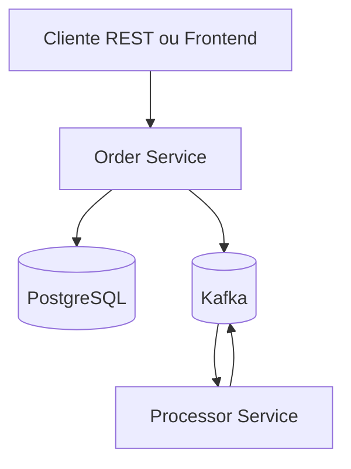
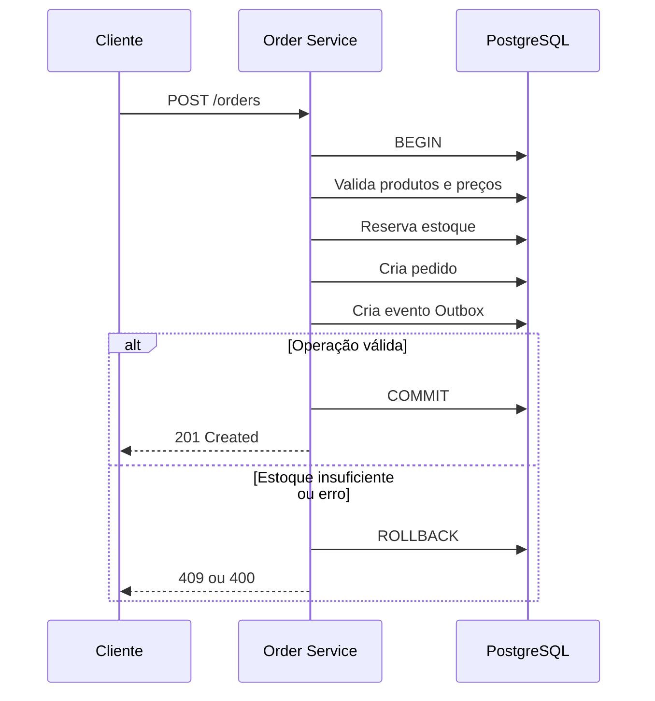
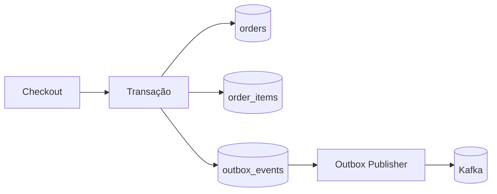
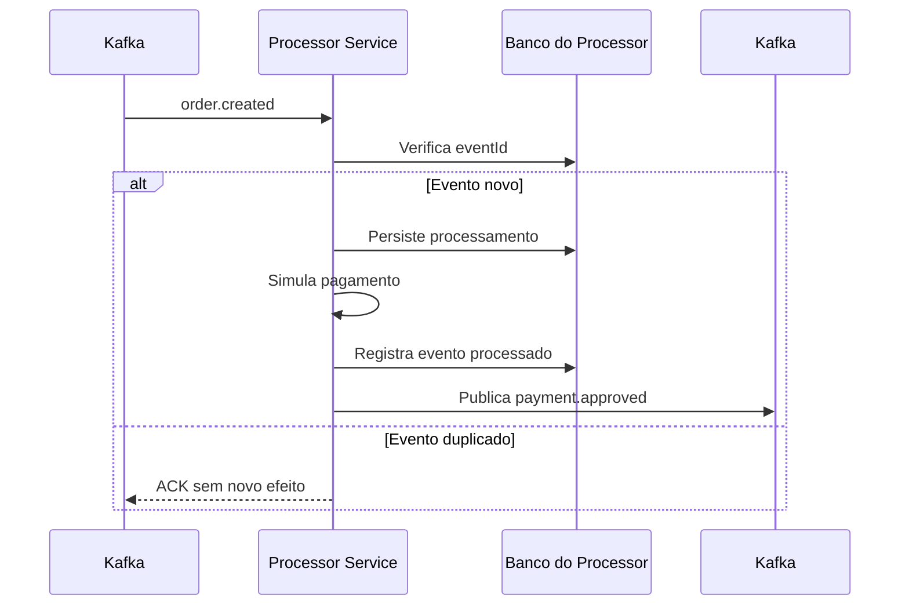
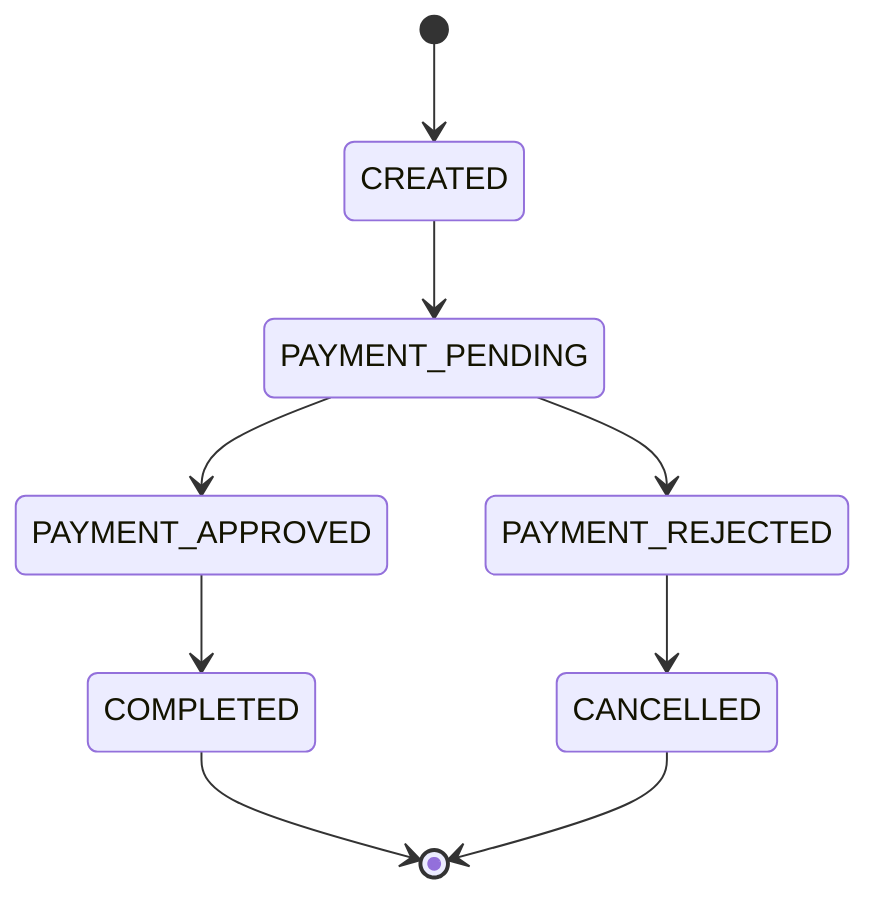
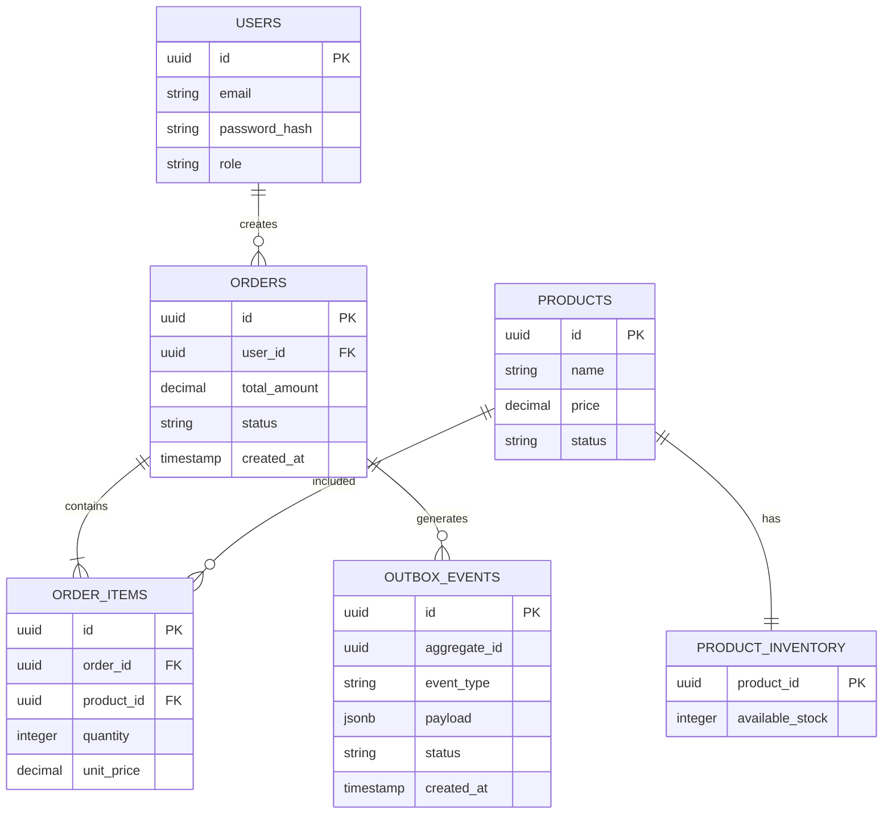
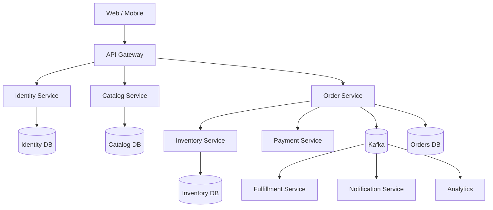

# Arquitetura do OrderFlow

## 1. Objetivo

O OrderFlow demonstra a evolução de uma API síncrona para um sistema de pedidos com processamento assíncrono confiável.

A arquitetura prioriza:

- Clareza.
- Consistência transacional.
- Baixo acoplamento.
- Testabilidade.
- Execução simples.
- Evolução incremental.

O projeto não tenta simular uma plataforma corporativa completa. Cada componente deve existir para resolver um problema real.

## 2. Arquitetura atual



A primeira implementação possui dois serviços:

| Serviço             | Responsabilidade                                         |
| ------------------- | -------------------------------------------------------- |
| `order-service`     | API, pedidos, catálogo, estoque e publicação de eventos  |
| `processor-service` | Consumo, processamento e publicação de eventos de status |

Catálogo, estoque e pedidos permanecem como módulos internos do `order-service`.

## 3. Organização modular

```text
order-service
└── com.orderflow
    ├── catalog
    │   ├── controller
    │   ├── service
    │   ├── repository
    │   └── model
    ├── inventory
    │   ├── service
    │   ├── repository
    │   └── model
    ├── order
    │   ├── controller
    │   ├── service
    │   ├── repository
    │   └── model
    ├── outbox
    │   ├── publisher
    │   ├── repository
    │   └── model
    ├── auth
    └── shared
```

A divisão por módulos permite evoluir o sistema sem criar microserviços prematuramente.

## 4. Fluxo do checkout



O preço deve ser obtido no banco. O cliente nunca deve ser considerado confiável para informar o valor final da compra.

## 5. Reserva atômica de estoque

O padrão inseguro seria:

```text
SELECT available_stock
if available_stock >= quantity:
    UPDATE available_stock
```

Entre o `SELECT` e o `UPDATE`, outra requisição poderia consumir o mesmo estoque.

A operação utilizada é atômica:

```sql
UPDATE product_inventory
SET available_stock = available_stock - :quantity
WHERE product_id = :productId
  AND available_stock >= :quantity;
```

A tabela também deve possuir:

```sql
CHECK (available_stock >= 0)
```

## 6. Transactional Outbox



A gravação do pedido e do evento ocorre no mesmo commit.

Isso evita:

```text
Pedido salvo + evento perdido
```

O Outbox Publisher pode usar:

```sql
SELECT *
FROM outbox_events
WHERE status = 'PENDING'
ORDER BY created_at
FOR UPDATE SKIP LOCKED
LIMIT 100;
```

### Semântica de entrega

O Outbox não garante exatamente uma publicação. Ele garante que o evento não será perdido após o commit do banco.

Falhas podem causar publicação duplicada. Portanto:

- Eventos precisam possuir `eventId`.
- Consumidores precisam ser idempotentes.
- O processamento deve ser confirmado somente após o commit da regra de negócio.

## 7. Idempotência

A idempotência deve possuir uma chave única por operação:

```http
POST /orders
Idempotency-Key: 01JEXAMPLE
```

Para consistência, a primeira versão pode utilizar uma tabela no PostgreSQL:

```text
idempotency_keys
- key
- user_id
- request_hash
- response_body
- response_status
- created_at
- expires_at
```

Redis pode ser adicionado posteriormente para reduzir latência, mas não deve ser a única fonte de verdade de uma operação financeira ou de criação de pedido.

## 8. Processor Service



O consumidor deve persistir o processamento e o registro de idempotência na mesma transação.

## 9. Estados do pedido



As transições devem ser validadas no domínio. Estados finais não podem voltar para estados anteriores.

## 10. Modelo de dados inicial



## 11. Segurança

A primeira versão deve conter:

- Hash de senha com Argon2id.
- JWT com algoritmo HS256 validado estritamente.
- Expiração curta do access token.
- Roles `CUSTOMER` e `ADMIN`.
- Verificação de ownership dos pedidos.
- Validação de entrada.
- Tratamento global de exceções.
- Ausência de stack traces nas respostas.

Refresh tokens, rate limiting e revogação distribuída podem ser adicionados posteriormente.

## 12. Arquitetura empresarial futura

Uma empresa maior poderia separar os bounded contexts:



Características esperadas:

- Cada serviço possui ownership de seus dados.
- Comunicação síncrona apenas quando a resposta for necessária.
- Eventos para integração assíncrona.
- Outbox em serviços que publicam eventos.
- Consumidores idempotentes.
- Observabilidade centralizada.
- API Gateway para autenticação, roteamento e proteção de borda.
- Deploy independente por serviço.

Essa arquitetura só deve ser adotada quando a escala, a organização dos times ou os requisitos operacionais justificarem a complexidade.

## 13. Evoluções possíveis

| Evolução           | Justificativa                                           |
| ------------------ | ------------------------------------------------------- |
| RabbitMQ           | Workflows específicos com filas e retries independentes |
| MinIO              | Upload de imagens de produtos                           |
| Inventory Ledger   | Auditoria completa de movimentações                     |
| WebSocket          | Atualização de status em tempo real                     |
| Cache Redis        | Gargalo mensurável no catálogo                          |
| CQRS               | Necessidade real de modelos de leitura especializados   |
| Mais microserviços | Escala ou ownership operacional independente            |
| Prometheus/Grafana | Necessidade de observabilidade operacional              |
