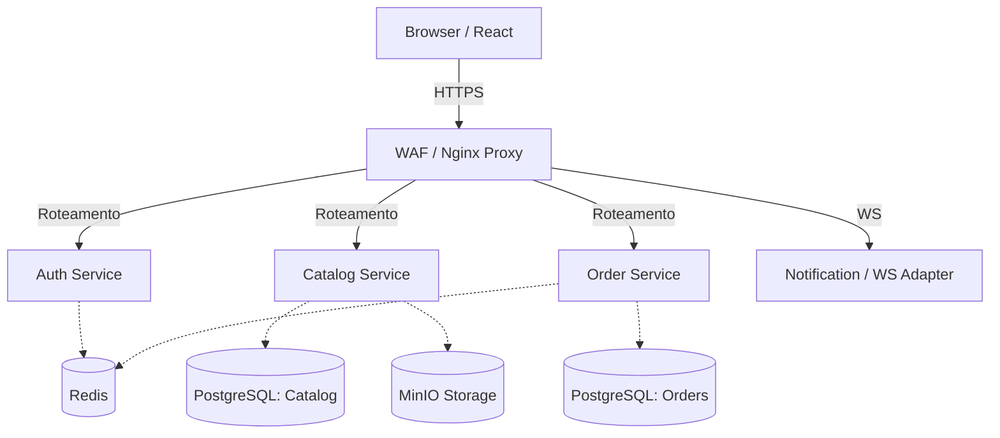
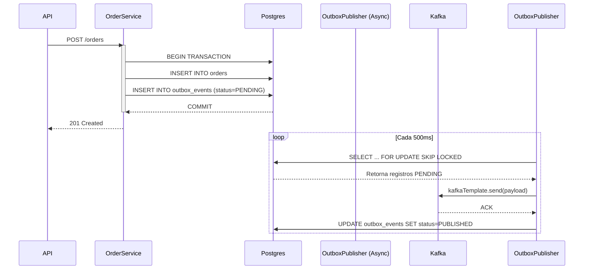

# Arquitetura do Sistema

Este documento detalha o desenho arquitetural, a divisão de responsabilidades e as estratégias de comunicação da plataforma OrderFlow.

## 1. Topologia e Gateway

A plataforma simula um ambiente exposto à internet, protegido por defesas de borda.

## 2. Microserviços e Responsabilidades

Adotamos a segregação por Bounded Contexts. Cada serviço é dono de seus dados.

### 🛡️ Auth Service (Identity)
*   **Responsabilidade:** Autenticação, autorização, gestão de usuários.
*   **Destaques:** 
    *   Hash Argon2id.
    *   Emissão de JWT (Access em payload, Refresh em HttpOnly Cookie).
    *   Gestão de Blacklist de Tokens e Lockout no **Redis**.
    *   Rate Limit via Bucket4j.

### 📦 Catalog Service (Catálogo e Uploads)
*   **Responsabilidade:** Gestão de produtos, categorias e imagens.
*   **Destaques:**
    *   CQRS simplificado: Escrita no Postgres, leitura com cache no Redis (quando justificado).
    *   **Zero-trust Upload:** Recebe imagem, envia pro MinIO (bucket `quarantine`). Publica evento no **RabbitMQ** para scan. Um consumer escaneia e move para o bucket `public`.

### 🛒 Order Service (Pedidos e Core Business)
*   **Responsabilidade:** Checkout, processamento e máquina de estados de pedidos.
*   **Destaques:**
    *   **Transactional Outbox Pattern:** Garante que o pedido salvo no Postgres será enviado ao Kafka.
    *   **Idempotência:** Protege a rota de checkout com chaves de idempotência validadas no Redis (Distributed Lock via Redisson).

### 💳 Payment Service (Simulação)
*   **Responsabilidade:** Processar pagamentos de forma assíncrona.
*   **Destaques:** Consome eventos do Kafka, aplica regra de aprovação/recusa e publica o resultado de volta no Kafka.

### 🔔 Notification Service (WS & Mail)
*   **Responsabilidade:** Ponte de comunicação com o cliente.
*   **Destaques:**
    *   Consome **Kafka** (`pedidos.status-atualizado`) para disparar WebSocket para o frontend (tracking em tempo real).
    *   Consome **RabbitMQ** para envio de e-mails transacionais (boletos, confirmações) com resiliência de DLQ.

## 3. Mensageria Híbrida: Kafka e RabbitMQ

| Característica | Apache Kafka (Eventos de Domínio) | RabbitMQ (Workflows Assíncronos) |
| :--- | :--- | :--- |
| **Padrão** | Event Streaming (Fato ocorrido, log imutável). | Message Queueing (Comandos, Tarefas, RPC). |
| **Casos de Uso** | `PedidoCriado`, `StatusAtualizado`. | Enviar E-mail, Scan de Arquivo, Auditoria Sec. |
| **Retenção** | Longa (Dias/Semanas). Permite replay. | Curta (Apaga ao processar - Ack). |
| **Escalabilidade** | Partições baseadas em chaves (`pedidoId`). | Filas concorrentes (Workers dinâmicos). |

## 4. O Padrão Transactional Outbox

O maior erro em sistemas distribuídos é fazer `db.save(pedido)` e logo após `kafka.send(evento)` no fluxo síncrono. Se o Kafka falhar ou a rede cair, há inconsistência silenciosa.

**Solução desenhada para o OrderFlow:**

*A cláusula `FOR UPDATE SKIP LOCKED` permite que múltiplas instâncias do OrderService rodem a rotina de Outbox sem conflitos de lock no banco.*