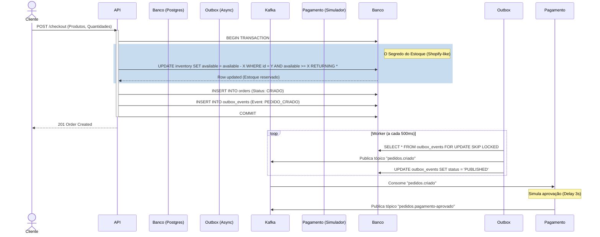

# Guia de Implementação e Regras de Negócio (OrderFlow)

Este documento define a visão do produto, os requisitos funcionais, o controle de acesso (RBAC) e o design de implementação de processos críticos (como a gestão de estoque concorrente), transformando a arquitetura técnica em uma plataforma de e-commerce real.

---

## 1. Visão do Produto e Funcionalidades Core

O **OrderFlow** não é apenas um passador de mensagens; é um motor de vendas B2C. Ele permite que administradores gerenciem um catálogo rico de produtos e que clientes naveguem, fechem pedidos (com garantia de estoque) e acompanhem a entrega em tempo real.

### 🛍️ Módulo de Catálogo (Catalog)
*   **Gestão de Categorias:** Hierarquia de categorias (ex: Eletrônicos > Periféricos > Teclados).
*   **Gestão de Produtos:** Nome, descrição, preço, categoria e status (Ativo/Inativo).
*   **Imagens (Zero-Trust):** Upload de múltiplas imagens por produto. Arquivos passam por uma fila RabbitMQ para scan (MinIO Quarantine) antes de ficarem públicos.
*   **Inventário (Estoque):** Controle rigoroso de unidades disponíveis, reservadas e vendidas, suportando altíssima concorrência.

### 🛒 Módulo de Vendas (Order & Checkout)
*   **Carrinho e Checkout:** O usuário seleciona produtos e finaliza a compra.
*   **Reserva de Estoque:** No momento do checkout, o estoque é subtraído atomicamente.
*   **Máquina de Estados (Kafka):** `CRIADO` -> `PAGAMENTO_PENDENTE` -> `PAGAMENTO_APROVADO` -> `SEPARACAO_ESTOQUE` -> `ENVIADO` -> `ENTREGUE`.

### 👥 Módulo de Identidade (Auth & RBAC)
Controle de Acesso Baseado em Papéis (RBAC). As *roles* são embutidas no payload do JWT.
*   **Role `CUSTOMER` (Cliente):** 
    *   Pode navegar no catálogo ativo.
    *   Pode criar pedidos para si mesmo.
    *   Pode visualizar apenas o seu próprio histórico de pedidos (Bloqueio de IDOR).
*   **Role `CATALOG_MANAGER` (Gerente de Catálogo):**
    *   Pode criar, editar e inativar produtos e categorias.
    *   Pode gerenciar o inventário (dar entrada em lotes de estoque).
*   **Role `ADMIN` (Administrador do Sistema):**
    *   Acesso total. Pode revogar tokens de qualquer usuário, ver dashboards globais e reprocessar Dead Letter Queues (DLQ).

---

## 2. Jornada de Venda e Integração de Sistemas

Como a venda acontece na prática, unindo as pontas da arquitetura:



---

## 3. A Engenharia de Estoque (Abordagem Relacional Avançada)

Em e-commerces (como a base inicial da Shopify), o controle de estoque sob alta concorrência costuma sofrer com *locks* de banco (ex: Black Friday, centenas de pessoas comprando a mesma TV). Usar Redis para estoque gera o problema de consistência eventual (vender sem ter). 

Vamos resolver isso 100% no PostgreSQL usando Padrão Ledger, Views e Constraints.

### 3.1. Modelagem de Dados do Estoque (Ledger)
Em vez de atualizar uma linha `quantidade = 50`, inserimos **movimentações**.

**Tabela `inventory_ledger` (Imutável):**
*   `id` (UUID)
*   `product_id`
*   `quantity` (Positivo para entrada, Negativo para venda/reserva)
*   `transaction_type` (INBOUND, RESERVED, SHIPPED, CANCELLED)
*   `reference_id` (O ID do Pedido associado)
*   `created_at`

**A View de Estoque Atual (`inventory_view`):**
```sql
CREATE VIEW inventory_view AS
SELECT product_id, SUM(quantity) as available_stock
FROM inventory_ledger
GROUP BY product_id;
```

### 3.2. A Constraint de Prevenção de Furo (Garantia Matemática)
Para evitar que uma venda deixe a soma negativa, usamos uma função e uma restrição (`CHECK constraint`) ou um Lock Otimista se agregarmos em uma tabela materializada. A abordagem mais pragmática e performática é a tabela de consolidação atômica:

```sql
-- Em vez de select e depois update (que gera race condition), fazemos tudo em uma instrução atômica no banco:
UPDATE product_inventory 
SET available_stock = available_stock - :qty 
WHERE product_id = :id AND available_stock >= :qty 
RETURNING available_stock;
```
Se a query não retornar linhas, significa que o `available_stock >= :qty` falhou. A aplicação lança um `OutOfStockException` e o pedido sofre *rollback* (junto com o Outbox) sem bloquear o banco. Simples, robusto e nativo.

### 3.3. Onde entra o `SKIP LOCKED`?
Usaremos o `SELECT ... FOR UPDATE SKIP LOCKED` em dois lugares cruciais:
1.  **Outbox Pattern:** Para ler os eventos pendentes de publicação no Kafka sem que as instâncias do serviço briguem pela mesma linha.
2.  **Separação de Estoque (Fulfillment):** Um processo em *background* que busca pedidos com status `PAGAMENTO_APROVADO` para enviar para a transportadora. Várias instâncias podem processar a fila de separação simultaneamente sem colisão.

---

## 4. Estrutura de Entidades (PostgreSQL)

Visão geral das tabelas por Bounded Context (organizadas logicamente, mesmo que no mesmo banco inicialmente).

### Contexto: Identidade (Auth)
*   `users`: id, name, email, password_hash (Argon2id), role, is_active, created_at.
*   `refresh_tokens`: id, user_id, token_hash, device_info, expires_at.

### Contexto: Catálogo (Catalog)
*   `categories`: id, name, slug, parent_id.
*   `products`: id, category_id, name, description, price, status.
*   `product_images`: id, product_id, image_url, is_main, scan_status (PENDING, CLEAN, INFECTED).
*   `product_inventory`: product_id (PK), available_stock.

### Contexto: Vendas (Order)
*   `orders`: id (UUID), user_id, total_amount, status, created_at, idempotency_key.
*   `order_items`: id, order_id, product_id, quantity, unit_price.
*   `outbox_events`: id, aggregate_id, event_type, payload (JSONB), status (PENDING/PUBLISHED).

---

## 5. Roteiro de Implementação

Siga esta ordem para construir o sistema de forma incremental e testável.

### Fase 1: Fundação e Catálogo (O Produto)
1.  **Modelagem e Migrations (Flyway/Liquibase):** Criar tabelas de Auth, Categorias e Produtos.
2.  **API de Catálogo:** Endpoints de CRUD para `CATALOG_MANAGER`.
3.  **Catálogo Público:** Endpoint de listagem (paginada) de produtos ativos para clientes.
4.  **Cache e Listagem**: Colocar o endpoint de listagem pública em cache no **Redis**, invalidando apenas quando o gerente atualizar um produto.

### Fase 2: Autenticação e Segurança 
1.  **Setup Argon2id e JWT:** Implementar o fluxo de login gerando Access Token e Refresh Token (no banco).
2.  **RBAC:** Configurar anotações `@PreAuthorize("hasRole('ADMIN')")` nos controllers de catálogo.
3.  **Defesas:** Rate Limit no endpoint de login (Bucket4j/Redis) e Blacklist de JWT para logout.

### Fase 3: Estoque e Vendas (O Core)
1.  **Tabela de Inventário:** Configurar a tabela de consolidação com `CHECK (available_stock >= 0)`.
2.  **API de Checkout:** Receber itens, validar preços atuais no banco.
3.  **Transação Atômica:** Executar o `UPDATE` de redução de estoque. Se falhar, retornar 409 Conflict (Estoque Indisponível). Se passar, criar o Pedido.
4.  **Idempotência:** Antes da transação, validar a `Idempotency-Key` no Redis.

### Fase 4: Mensageria e Outbox (Sistemas Distribuídos)
1.  **Outbox Tabela e Worker:** Na mesma transação do checkout, inserir em `outbox_events`. Criar o `@Scheduled` com `SKIP LOCKED` para publicar no Kafka.
2.  **Tópicos Kafka:** Criar `pedidos.criado`.
3.  **Simulador de Pagamento:** Um consumer (no serviço `processamento`) que lê `pedidos.criado`, aplica um `Thread.sleep` (simulando gateway), e publica `pedidos.pagamento-aprovado` (ou recusado).
4.  **Tracking via WebSocket:** O serviço `ws-adapter` consome as mudanças de status e notifica o Front-end.

### Fase 5: Integrações Avançadas (RabbitMQ & MinIO)
1.  **Auditoria e Alertas:** Enviar falhas de login contínuas para o RabbitMQ, com um consumer simulando alerta.
2.  **Upload Zero-Trust:** Na criação do produto, enviar imagem para o MinIO (bucket: *quarantine*). Postar evento no RabbitMQ. Consumer escaneia (simulado) e move para *public*.