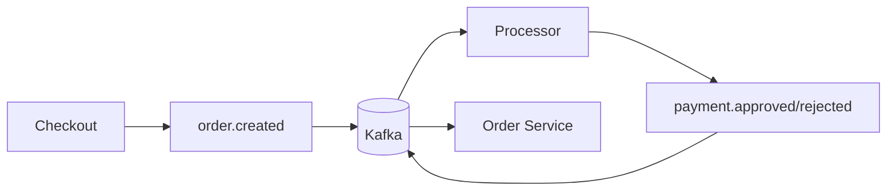
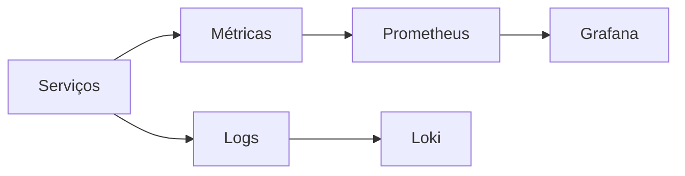
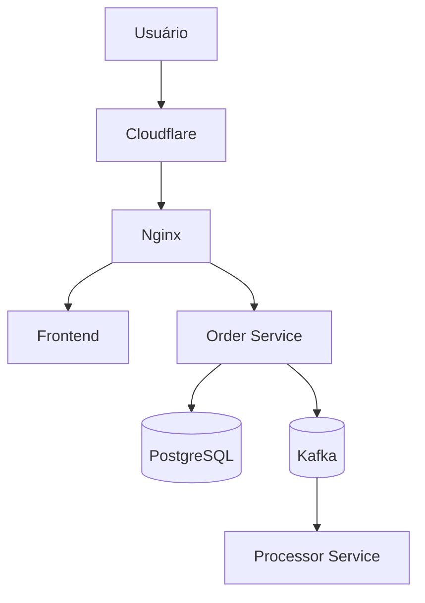

# Roadmap de Implementação

## Objetivo

Construir um e-commerce pequeno, funcional e testável, cujo principal diferencial seja o processamento confiável de pedidos com Kafka.

Cada fase deve gerar uma aplicação executável. Tecnologias adicionais só devem entrar quando resolverem um problema identificado.

## Fase 0 — Fundação

- [ ] Configurar Java 21 e Spring Boot.
- [ ] Configurar Gradle multi-módulo.
- [ ] Configurar Docker Compose.
- [ ] Subir PostgreSQL e Kafka.
- [ ] Configurar Flyway.
- [ ] Configurar profiles local e teste.
- [ ] Adicionar Actuator.
- [ ] Adicionar OpenAPI.
- [ ] Criar tratamento global de exceções.
- [ ] Configurar CI com build e testes.

**Entregável:** aplicação inicia, banco migra e health check responde.

## Fase 1 — Catálogo

- [ ] Criar tabela de produtos.
- [ ] Criar tabela de categorias, se necessário.
- [ ] Criar tabela de estoque.
- [ ] Implementar cadastro administrativo.
- [ ] Implementar listagem pública paginada.
- [ ] Permitir produtos ativos e inativos.
- [ ] Impedir estoque negativo.

**Entregável:** produtos podem ser cadastrados e consultados.

## Fase 2 — Checkout síncrono

- [ ] Criar tabelas de pedidos e itens.
- [ ] Criar endpoint de checkout.
- [ ] Validar produtos existentes.
- [ ] Calcular total no backend.
- [ ] Copiar o preço atual para o item do pedido.
- [ ] Reservar estoque dentro de uma transação.
- [ ] Retornar `409 Conflict` para estoque insuficiente.
- [ ] Criar consulta de pedido.

**Entregável:** é possível criar e consultar um pedido via Swagger ou curl.

## Fase 3 — Concorrência e idempotência

- [ ] Implementar atualização atômica do estoque.
- [ ] Adicionar `CHECK (available_stock >= 0)`.
- [ ] Adicionar `Idempotency-Key`.
- [ ] Criar restrição única para evitar duplicidade.
- [ ] Persistir o resultado da operação idempotente.
- [ ] Criar teste com várias compras simultâneas.
- [ ] Criar teste de retry da mesma requisição.

### Cenário obrigatório

```text
Estoque: 1
Requisições simultâneas: 10

Resultado:
- 1 pedido criado
- 9 conflitos
- estoque final igual a 0
- nenhum estoque negativo
```

**Entregável:** retries não duplicam pedidos e a concorrência é segura.

## Fase 4 — Kafka e Processor

- [ ] Adicionar Kafka ao ambiente local.
- [ ] Criar tópico `order.created`.
- [ ] Criar tópico `order.status.updated`.
- [ ] Criar producer.
- [ ] Criar `processor-service`.
- [ ] Criar consumer.
- [ ] Simular processamento de pagamento.
- [ ] Publicar aprovação ou rejeição.
- [ ] Atualizar o status do pedido.
- [ ] Usar `orderId` como chave da mensagem.



**Entregável:** o pedido muda de status de forma assíncrona.

## Fase 5 — Transactional Outbox

- [ ] Criar tabela `outbox_events`.
- [ ] Gravar pedido e evento na mesma transação.
- [ ] Criar Outbox Publisher.
- [ ] Buscar eventos pendentes com `SKIP LOCKED`.
- [ ] Publicar eventos no Kafka.
- [ ] Marcar eventos publicados.
- [ ] Registrar tentativas e erros.
- [ ] Implementar retry com backoff.
- [ ] Remover publicação direta durante o checkout.
- [ ] Testar Kafka indisponível.

### Cenário obrigatório

```text
1. Kafka está indisponível.
2. Checkout é confirmado no PostgreSQL.
3. Evento permanece como PENDING.
4. Kafka volta a funcionar.
5. Worker publica o evento.
```

**Entregável:** um pedido confirmado não perde seu evento.

## Fase 6 — Consumidor idempotente

- [ ] Adicionar `eventId` aos eventos.
- [ ] Criar tabela de eventos processados.
- [ ] Registrar evento e efeito na mesma transação.
- [ ] Ignorar eventos já processados.
- [ ] Validar transições de status.
- [ ] Configurar tratamento de mensagens inválidas.
- [ ] Testar reprocessamento da mesma mensagem.

**Entregável:** duplicação de mensagens não duplica efeitos.

## Fase 7 — Autenticação e autorização

- [ ] Criar tabela de usuários.
- [ ] Implementar login.
- [ ] Utilizar Argon2id para senhas.
- [ ] Emitir JWT HS256 com expiração.
- [ ] Criar roles `CUSTOMER` e `ADMIN`.
- [ ] Proteger endpoints administrativos.
- [ ] Garantir que o cliente só consulte seus próprios pedidos.
- [ ] Padronizar respostas `401` e `403`.

**Entregável:** o fluxo possui autenticação e proteção contra IDOR.

## Fase 8 — Testes e qualidade

### Testes unitários

- [ ] Cálculo do total.
- [ ] Validação do checkout.
- [ ] Reserva de estoque.
- [ ] Máquina de estados.
- [ ] Idempotência.
- [ ] Transições inválidas.

### Testes de integração

- [ ] PostgreSQL com Testcontainers.
- [ ] Kafka com Testcontainers.
- [ ] Execução das migrations.
- [ ] Checkout completo.
- [ ] Publicação da Outbox.
- [ ] Consumo de eventos.
- [ ] Reprocessamento.

### Testes de concorrência

- [ ] Venda simultânea da última unidade.
- [ ] Retry simultâneo com a mesma chave.
- [ ] Dois workers processando a Outbox.
- [ ] Consumer recebendo evento duplicado.

**Entregável:** os principais riscos do sistema são cobertos por testes automatizados.

## Fase 9 — Observabilidade básica

- [ ] Logs estruturados.
- [ ] Correlation ID HTTP.
- [ ] Propagação do identificador para eventos.
- [ ] Métrica de pedidos criados.
- [ ] Métrica de conflitos de estoque.
- [ ] Métrica de eventos pendentes.
- [ ] Health checks dos serviços.

Evolução posterior:



## Fase 10 — Frontend

- [ ] Criar frontend simples.
- [ ] Listar produtos.
- [ ] Criar checkout.
- [ ] Consultar pedido.
- [ ] Exibir mudanças de status por polling.
- [ ] Criar Dockerfiles.
- [ ] Criar compose de produção.
- [ ] Configurar variáveis de ambiente.



## Definição de pronto da versão 1.0

- [ ] Usuário consulta produtos.
- [ ] Usuário cria pedido.
- [ ] Estoque é reservado atomicamente.
- [ ] Retries não criam pedidos duplicados.
- [ ] Pedido e Outbox são confirmados juntos.
- [ ] Evento é publicado no Kafka.
- [ ] Processor atualiza o status.
- [ ] Eventos duplicados não duplicam efeitos.
- [ ] Testes de integração passam.
- [ ] Sistema executa com Docker Compose.
- [ ] Documentação explica as principais decisões.

## Evoluções futuras

| Funcionalidade       | Quando considerar                                          |
| -------------------- | ---------------------------------------------------------- |
| WebSocket            | Quando o tracking em tempo real melhorar a demonstração    |
| Cache de catálogo    | Quando houver gargalo de leitura mensurável                |
| RabbitMQ             | Quando existir workflow independente de eventos de domínio |
| MinIO                | Quando imagens forem parte do produto                      |
| Inventory Ledger     | Quando auditoria detalhada for requisito                   |
| CQRS                 | Quando as consultas exigirem modelo próprio                |
| Mais microserviços   | Quando houver escala ou ownership independente             |
| Multi-região         | Quando houver requisito real de disponibilidade global     |

## Critério para novas tecnologias

Antes de adicionar qualquer componente:

1. Qual problema ele resolve?
2. Esse problema existe atualmente?
3. PostgreSQL, Spring ou Kafka já resolvem?
4. Qual é o custo de operação e manutenção?
5. Como a solução será testada?
6. Como a decisão será explicada em uma entrevista?

Se não houver uma resposta clara, a tecnologia deve permanecer no roadmap.
