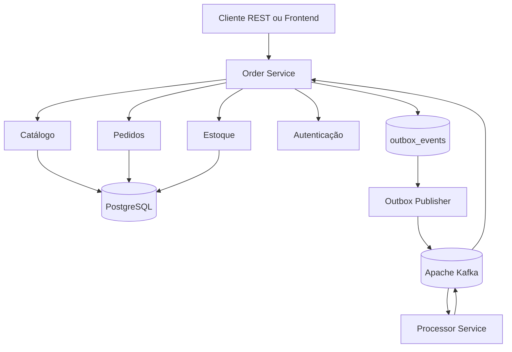
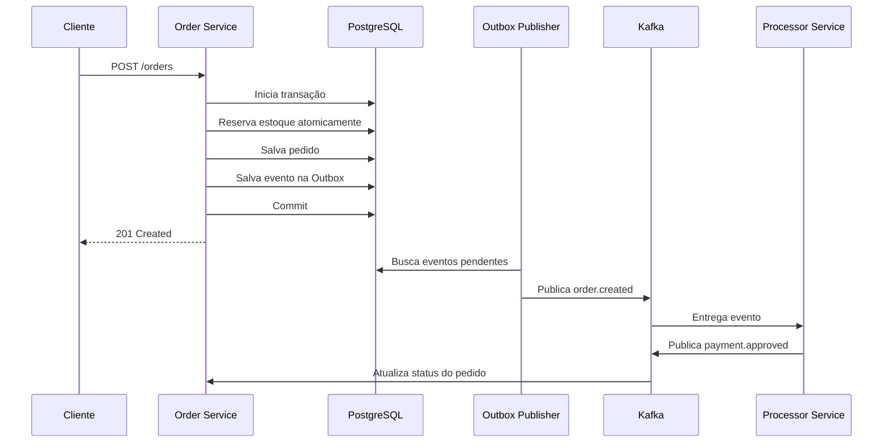
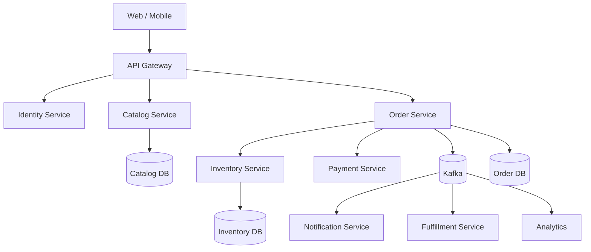

# OrderFlow

> Plataforma de e-commerce desenvolvida com Java e Spring Boot para demonstrar concorrência, consistência de dados e processamento assíncrono com Kafka.

## Sobre o projeto

O OrderFlow começou como um laboratório de Kafka para processamento de pedidos. Durante a implementação, surgiram problemas comuns em sistemas distribuídos:

- O pedido pode ser salvo no banco e o evento não ser publicado.
- Retries podem criar pedidos duplicados.
- Duas requisições podem tentar comprar a última unidade.
- Um consumidor pode falhar durante o processamento.
- Serviços podem evoluir de forma independente.

O projeto transforma esses problemas em uma aplicação funcional de e-commerce.

O foco principal é demonstrar:

- Reserva concorrente de estoque.
- Idempotência.
- Kafka.
- Transactional Outbox.
- Processamento assíncrono.
- Testes de integração com infraestrutura real.

## Objetivos

- Disponibilizar catálogo de produtos.
- Criar pedidos por meio de checkout.
- Reservar estoque de forma atômica.
- Processar pedidos assincronamente.
- Evitar inconsistências entre PostgreSQL e Kafka.
- Validar eventos duplicados.
- Executar toda a infraestrutura localmente com Docker Compose.

## Arquitetura da versão de portfólio



### Serviços

| Componente          | Responsabilidade                                                   |
| -------------------- | -------------------------------------------------------------------- |
| `order-service`     | API REST, catálogo, pedidos, estoque, autenticação e Outbox         |
| `processor-service` | Consumo de eventos, simulação de pagamento e publicação de status   |
| PostgreSQL          | Fonte de verdade de todos os dados transacionais, incluindo idempotência |
| Kafka               | Comunicação assíncrona e eventos de domínio                         |

O projeto utiliza dois serviços para demonstrar comunicação assíncrona sem criar microserviços artificialmente.

## Fluxo principal



## Problemas e soluções

| Problema                             | Solução                            |
| ------------------------------------ | ----------------------------------- |
| Banco confirmado, Kafka indisponível | Transactional Outbox               |
| Retry criando pedidos duplicados     | Idempotência                       |
| Venda concorrente da última unidade  | `UPDATE` condicional no PostgreSQL |
| Evento entregue mais de uma vez      | Consumidor idempotente             |
| Workers processando o mesmo evento   | `FOR UPDATE SKIP LOCKED`           |

## Estoque concorrente

A reserva utiliza uma operação atômica:

```sql
UPDATE product_inventory
SET available_stock = available_stock - :quantity
WHERE product_id = :productId
  AND available_stock >= :quantity;
```

Se nenhuma linha for atualizada, o estoque é insuficiente e a API retorna `409 Conflict`.

O PostgreSQL permanece como fonte de verdade. Redis não é utilizado para controlar o saldo do estoque.

## Transactional Outbox

O pedido e o evento são persistidos na mesma transação:

```text
BEGIN
  INSERT INTO orders
  INSERT INTO order_items
  INSERT INTO outbox_events
COMMIT

Outbox Publisher
  └── publica eventos pendentes no Kafka
```

A publicação possui semântica **at-least-once**. Portanto, os consumidores devem ser idempotentes.

## Idempotência

A chave `Idempotency-Key` é armazenada e verificada no PostgreSQL, na mesma base transacional do pedido — não em Redis. Isso evita que a criação de um pedido dependa da disponibilidade de um componente de cache para permanecer correta.

## Stack

- Java 21
- Spring Boot
- Spring Data JPA
- Spring Security
- PostgreSQL
- Flyway
- Apache Kafka
- Docker Compose
- JUnit
- Testcontainers
- OpenAPI/Swagger
- Spring Boot Actuator

## Estrutura

```text
OrderFlow/
├── order/
│   └── Order Service
├── processor/
│   └── Processor Service
├── infra/
│   └── Docker Compose
├── README.md
├── ARCHITECTURE.md
└── IMPLEMENTATION_ROADMAP.md
```

## Execução local

```bash
docker compose -f infra/docker-compose.yml up -d
```

## Evolução para uma arquitetura empresarial

Em uma empresa maior, os módulos poderiam ser separados conforme necessidade operacional:



Essa separação não faz parte da primeira versão. Ela seria justificada por:

- Times independentes.
- Escala diferente entre domínios.
- Necessidades de disponibilidade distintas.
- Deploys independentes.
- Limites claros de ownership dos dados.

## O que não faz parte da versão inicial

- Redis, como cache ou fonte de idempotência.
- RabbitMQ.
- MinIO.
- Antivírus para uploads.
- CQRS formal.
- Inventory Ledger.
- WebSocket obrigatório.
- Serviço separado de autenticação.
- Serviço separado de catálogo.
- Multi-região.
- Service mesh.

Esses itens permanecem como evoluções possíveis, não como requisitos artificiais.

## Estado do projeto

- [x] Infraestrutura local inicial
- [x] API inicial de pedidos
- [x] Persistência PostgreSQL
- [x] Publicação inicial no Kafka
- [ ] Consumer do Processor
- [ ] Máquina de estados
- [ ] Idempotência de consumidores
- [ ] Transactional Outbox
- [ ] Testes de concorrência
- [ ] Autenticação JWT